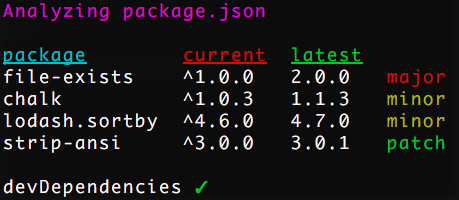

# Analyze Deps CLI

Compare dependencies in package.json to the latest available versions.

## Installation

```shell
npm install -g analyze-deps-cli
```

## Usage

```shell
deps
```



## License

[MIT](http://moroshko.mit-license.org)
